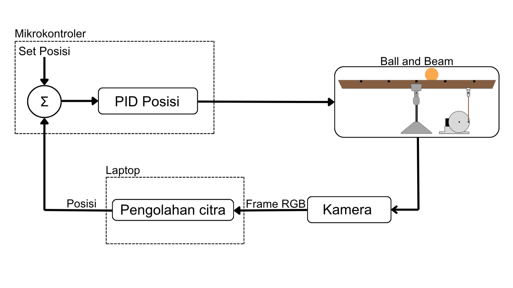
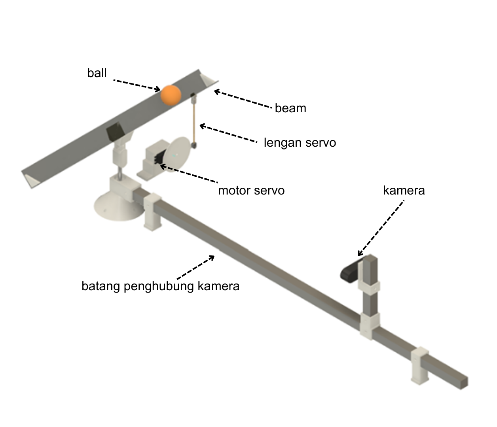
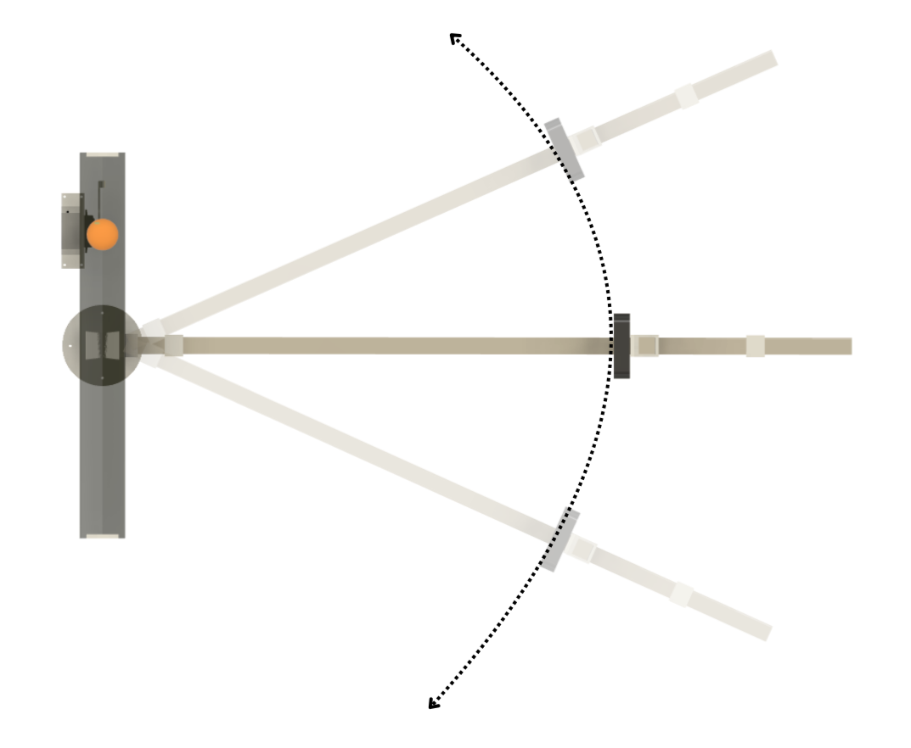
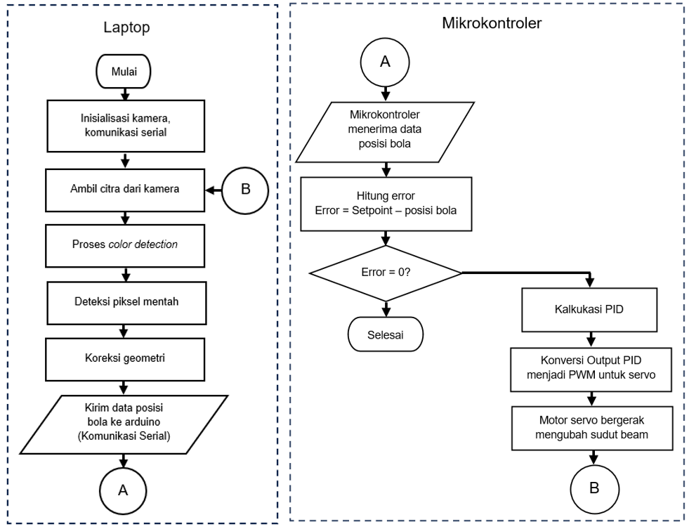
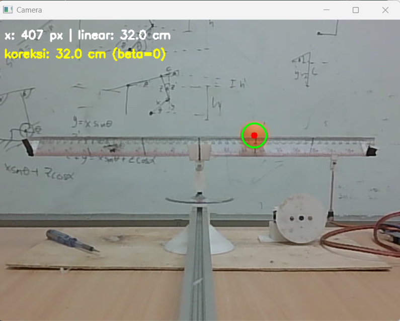
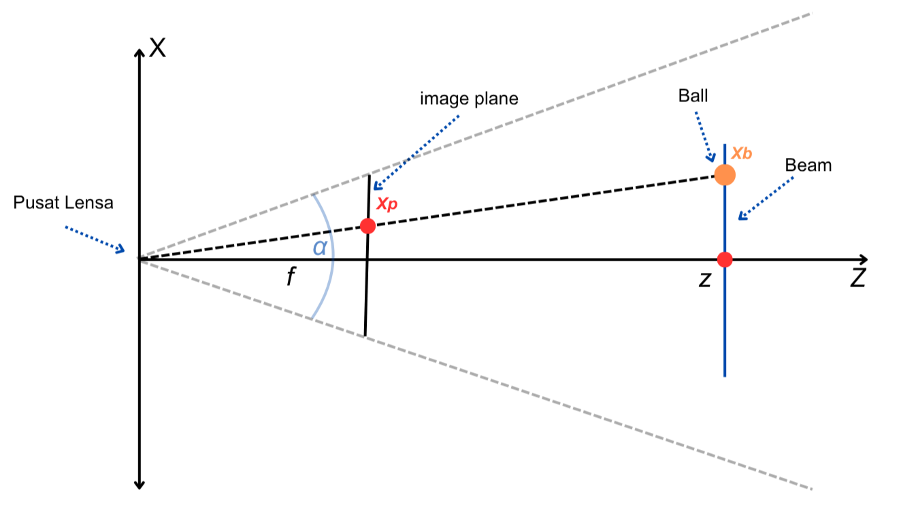
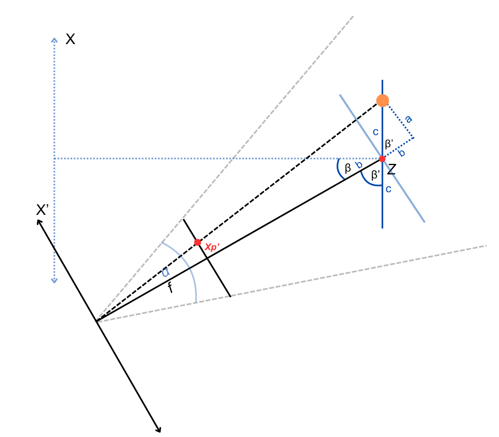

# Ball and Beam Berbasis Kamera dengan Pengendali PID dan Koreksi Geometri

Sistem ball and beam berbasis kamera dengan pengendali PID pada **ESP32-C3**, dilengkapi model koreksi geometri (pinhole camera) untuk mengoreksi distorsi pembacaan posisi bola akibat kemiringan pemasangan kamera. Proyek ini adalah skripsi Teknik Elektro, Universitas Hasanuddin.

> **Objective:** Keep a ball at a camera-measured setpoint on a beam using PID control, and quantify how camera mounting angle distorts position readings and control performance, with and without geometric correction.

## Ringkasan

Sistem terdiri dari laptop (akuisisi citra, deteksi bola berbasis HSV dengan OpenCV, dan koreksi geometri) dan mikrokontroler ESP32-C3 (kendali PID 100 Hz dengan timer interrupt dan penggerak motor servo), terhubung lewat komunikasi serial. Kamera dipasang pada lengan busur sehingga sudut pemasangan (β) dapat divariasikan tanpa mengubah jarak kamera ke beam. Model koreksi diuji pada lima sudut kamera: −40°, −30°, 0°, +30°, dan +40°.

## Hasil Utama

- Tanpa koreksi, kemiringan kamera menyebabkan distorsi pembacaan posisi hingga **33,3%** (β = +40°).
- Koreksi geometri menurunkan RMSE pengukuran posisi sebesar **91,2%** secara keseluruhan (2,32 cm menjadi 0,20 cm, n = 60).
- Penyimpangan IAE terhadap baseline (β = 0°) turun dari **35,2-69,3%** menjadi **2,5-18,1%**.
- Penyimpangan overshoot turun dari 75,7-227,6% menjadi 13,6-95,3%, jadi belum sepenuhnya kembali ke baseline.

## Arsitektur Sistem

*Gambar 1. Diagram blok Ball and Beam berbasis kamera.*

*Gambar 2. Konfigurasi sistem keseluruhan.*

**Tabel I. Komponen sistem**

| No. | Komponen | Fungsi |
|---|---|---|
| 1 | Laptop | Pengolahan citra dan deteksi posisi bola |
| 2 | Webcam | Sensor visual penangkap citra bola secara real-time |
| 3 | ESP32-C3 | Eksekusi kendali PID dan penggerak motor servo |
| 4 | Motor servo | Mengatur sudut kemiringan beam |
| 5 | Beam (akrilik) | Lintasan gerak bola |

Kamera dipasang pada lengan busur, sehingga sudut pemasangan (β) bisa diubah tanpa mengubah jarak kamera ke beam. Dengan begitu pengaruh sudut dapat diuji terpisah dari pengaruh jarak.

*Gambar 3. Mekanisme perpindahan kamera.*

### Alur Program

*Gambar 4. Flowchart sistem ball and beam.*

Laptop mengambil frame, mendeteksi bola, mengoreksi posisi, lalu mengirim data lewat serial. ESP32-C3 menjalankan PID secara independen pada 100 Hz (timer interrupt), terlepas dari frame rate kamera, dan keluarannya berupa PWM ke motor servo melalui mekanisme crank-disc.

## Deteksi Posisi Bola

Frame dikonversi dari RGB ke ruang warna HSV (lebih tahan terhadap perubahan iluminasi dan bayangan), lalu masking berdasarkan rentang HSV mengisolasi piksel bola. Posisi bola diambil dari centroid objek dalam satuan piksel.

*Gambar 5. Hasil deteksi bola menggunakan metode color detection berbasis HSV.*

## Model Koreksi Geometri

Pada kamera normal (β = 0°), proyeksi posisi bola ke bidang citra bersifat linier:

*Gambar 6. Geometri posisi kamera terhadap beam pada kondisi normal.*

Ketika kamera dimiringkan sebesar β, proyeksi piksel menjadi nonlinier:

*Gambar 7. Geometri posisi kamera terhadap beam pada kondisi miring.*

Posisi bola aktual c (cm dari pusat beam) diperoleh dari posisi piksel x'ₚ = x_pixel − p₀:

$$c = \frac{x'_p \cdot z}{f\cos\beta - x'_p \sin\beta}$$

Karena PID bekerja di domain piksel, posisi terkoreksi dikonversi kembali ke piksel linier:

$$x_{linear} = p_0 + c \cdot s_{px}$$

dengan s_px adalah faktor skala piksel-ke-sentimeter pada kondisi tidak terdistorsi.

**Parameter kalibrasi** (ditentukan pada β = 0°, dipakai untuk semua sudut):

| Parameter | Nilai |
|---|---|
| p₀ (piksel referensi pusat beam) | 320 piksel |
| z (jarak kamera ke beam) | 67,3 cm |
| L (panjang beam) | 49 cm |
| f (focal length) | ≈ 733,3 piksel |

## Kendali PID

- Error: e(t) = x_ref(t) − x(t)
- Komponen turunan difilter dengan low-pass filter orde pertama (α = 0,5) untuk meredam derau akibat interval pembaruan data posisi yang tidak seragam.
- Keluaran: PWM(t) = DC + u(t), dengan DC adalah PWM referensi pada posisi beam horizontal.
- Sistem dikarakterisasi sebagai double integrator, R(s)/Θ(s) = K/s². Fungsi alih ini hanya dipakai untuk identifikasi karakteristik dinamis, bukan dasar perancangan. Nilai K tidak dihitung, parameter PID ditentukan lewat tuning empiris.

**Tabel II. Parameter final PID**

| Parameter | Nilai |
|---|---|
| Kp | 2.25 |
| Ki | 0.5 |
| Kd | 4.6 |
| α (LPF) | 0.5 |

**Proses tuning (trial and error, bertahap):**

1. Proporsional saja: osilasi berkelanjutan (5 siklus dalam 20 detik, amplitudo puncak-ke-puncak ≈ 487 piksel).
2. Menambah turunan tanpa filter: tidak ada perbaikan berarti, karena derau ikut terdiferensiasi.
3. Turunan dengan low-pass filter: respons jauh lebih stabil, tetapi tersisa steady-state error ≈ −1,2 cm.
4. Menambah integral: error tunak hilang, menghasilkan parameter pada Tabel II.

## Hasil Pengujian

### Akurasi pengukuran posisi

Pengujian memakai 5 titik uji (8, 16, 24, 32, 40 cm) dengan 3 kali penempatan independen per titik, pada lima sudut kamera.

**Tabel V. Distorsi pembacaan posisi awal bola tanpa koreksi geometri**

| β | Distorsi (%) |
|---|---|
| −40° | 10,1 |
| −30° | 1,1 |
| 0° | 0,0 |
| +30° | 22,7 |
| +40° | 33,3 |

**Tabel IV. RMSE pengukuran posisi: model linear vs koreksi geometri**

| Kondisi | RMSE linear (cm) | RMSE koreksi (cm) | Reduksi (%) |
|---|---|---|---|
| β = −30° | 1,94 | 0,29 | 85,1 |
| β = +30° | 1,65 | 0,22 | 86,8 |
| β = −40° | 2,77 | 0,068 | 97,6 |
| β = +40° | 2,71 | 0,166 | 93,9 |
| Gabungan β = ±30° (n = 30) | 1,80 | 0,26 | 85,6 |
| Gabungan β = ±40° (n = 30) | 2,74 | 0,127 | 95,4 |
| Gabungan seluruh β ≠ 0° (n = 60) | 2,32 | 0,20 | 91,2 |

### Performa kendali (30 FPS)

Seluruh pengujian memakai parameter PID yang sama, arah step yang sama, dan 3 kali pengulangan per kondisi. Metrik utama adalah Integral of Absolute Error (IAE). Persentase dalam kurung adalah penyimpangan terhadap baseline.

Baseline (β = 0°): IAE 239,1 ± 45,3 px·s, overshoot 4,93 ± 3,28 %.

| β | IAE tanpa koreksi (px·s) | IAE dengan koreksi (px·s) | Overshoot tanpa koreksi (%) | Overshoot dengan koreksi (%) |
|---|---|---|---|---|
| −40° | 330,4 (+38,2%) | 257,3 (+7,6%) | 14,90 (+202,2%) | 9,63 (+95,3%) |
| −30° | 326,4 (+36,5%) | 274,0 (+14,6%) | 8,66 (+75,7%) | 7,81 (+58,4%) |
| +30° | 323,2 (+35,2%) | 282,4 (+18,1%) | 10,31 (+109,1%) | 7,57 (+53,5%) |
| +40° | 404,9 (+69,3%) | 245,0 (+2,5%) | 16,15 (+227,6%) | 5,60 (+13,6%) |

### Pemeriksaan konsistensi pada 15 FPS

Dengan koreksi geometri aktif, pengujian diulang pada 15 FPS sebagai pemeriksaan tambahan, bukan analisis pengaruh frame rate secara mandiri.

**Tabel VIII. Performa kendali PID dengan koreksi geometri pada 15 FPS**

| β | IAE (px·s) | Rise time (s) | Overshoot (%) |
|---|---|---|---|
| −40° | 342,3 ± 72,9 | 1,71 ± 1,08 | 9,49 ± 3,88 |
| −30° | 277,1 ± 54,8 | 0,89 ± 0,07 | 10,73 ± 3,80 |
| +30° | 284,9 ± 68,9 | 0,93 ± 0,00 | 10,25 ± 3,85 |
| +40° | 307,7 ± 73,5 | 1,44 ± 0,95 | 8,46 ± 5,76 |

Pola antar sudut pada 15 FPS hanya sebagian konsisten dengan 30 FPS, sehingga manfaat koreksi pada 30 FPS tidak otomatis berlaku pada laju bingkai yang lebih rendah.

## Keterbatasan

- Residual kesalahan pengukuran setelah koreksi menunjukkan pola asimetris antara sudut positif dan negatif, kemungkinan akibat asimetri mekanis sistem. Ini belum diinvestigasi lebih lanjut.
- Overshoot belum sepenuhnya kembali ke level baseline setelah koreksi.
- Steady-state error tidak menunjukkan pola perbaikan yang konsisten. Pengendali memiliki deadband ±8 piksel (≈ 0,74 cm), sehingga posisi akhir lebih ditentukan variabilitas mekanis daripada akurasi pengukuran.
- Parameter kalibrasi (f, z, p₀) ditentukan pada β = 0° dan dipakai untuk semua sudut. Setiap kondisi uji diulang 3 kali.

## Penulis

**Izzuddin Alqassam**, Teknik Elektro, Universitas Hasanuddin
Pembimbing: A. Ejah Umraeni Salam
Fokus: sistem kontrol, PLC, otomasi industri